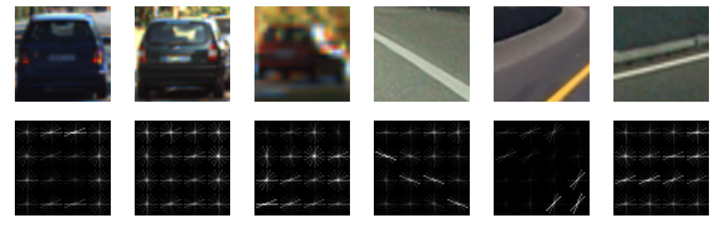
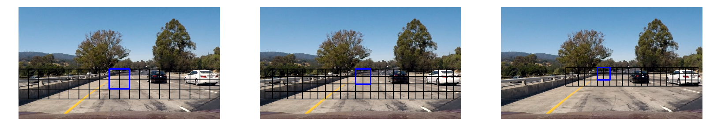

# Vehicle Detection

## Introduction

This was the fifth and final project for term 1 of Udacity's Self-Driving Car Nanodegree course. The goal was to make a classifier that could reliably detect whether an image was a car or not, then use that classifier to find the location of cars in a big picture with multiple cars (and ultimately to a video)

## Getting Started

### Requirements:
Jupyter  
OpenCV

### Following along

The dataset used for training the classifier consists of two external datasets: Udacity's dataset and the Autti dataset.

Download the Autti dataset from [here](https://github.com/udacity/self-driving-car/tree/master/annotations) and extract into dataset/autti

Download the Udacity vehicle dataset from [here](https://s3.amazonaws.com/udacity-sdc/Vehicle_Tracking/vehicles.zip) and extract it into dataset/vehicles

Download the Udacity vehicle dataset from [here](https://s3.amazonaws.com/udacity-sdc/Vehicle_Tracking/non-vehicles.zip) and extract it into dataset/non-vehicles

Then simply open the Jupyter notebook
`jupyter notebook VehicleDetection.ipynb`
and follow along!

## Ruberic points

Here I will explain each of the project ruberic points.

### Histogram of Oriented Gradients(HOG)

#### Explain how (and identify where in your code) you extracted HOG features from the training images. 

The code for this is found inside of `get_hog_features` and `extract_features`

#### Explain how you settled on your final choice of HOG parameters.

I tried a few different parameters, so here's my explanantion for each:

Color space: I tried 5 possibilities for color space: Gray, Saturation, and each of R,G, and B
I also played around with Hue and Lightness, neither of which I found to give much important information.
I ended up finding that using greyscale worked best for this.

Orientations: I tried the default 8 and that tended to work well, and I found no reason to change it.

Pixels per cell: I wanted this to be relatively high because I thought having less blocks would make the gradients stronger, therefore making the information of that particular block better and making lines stand out. I decided on 16.

Cells per block: I did not want to average multiple cells per block because my pixels per cell was already pretty high. 

#### Describe how (and identify where in your code) you trained a classifier using your selected HOG features (and color features if you used them).

I found that the default dataset had a notable bias toward black cars, as my classifier was initially just finding the black car. I decided to take some images from the autti dataset. I'm using 4000 cars from the original dataset, 10,000 cars from the autti dataset, and all non-cars from the original dataset plus 40,000 non-car examples from the autti dataset.

They're trained using the default rbc kernel in the SVC classifier.

### Sliding Window Search

#### Describe how (and identify where in your code) you implemented a sliding window search. 

This happens in `slide_window`. It finds the region that it's going to be sliding around and makes a list of window positions, then checks each of those windows.

#### How did you decide what scales to search and how much to overlap windows?

I first tried a 128x128 video, but that stopped working as the cars went out of view.  
I then tried a 96 x 96 video, and that was better but stopped catching the cars close up.  

I settled on doing 128x128, 96x96, and 80x80 windows, which worked really well after trying a .5 overlap.

I also made sure that the y never went above half the screen, because we're never going to see a car there. That sped up computation by quite a bit.

#### Show some examples of test images to demonstrate how your pipeline is working.

#### How did you optimize the performance of your classifier?

I made sure my training data was good first. I saw that there was a tendency to identify the black car over other cars, and looking though my initial training data I found a lot of black cars, so I decided to augment the data with extra data from the autti dataset.

I also switched from the linear SVC that Udacity recommended I try and wnet to an SVC with an rbf kernel. This got my accuracy up to around 97%.

Apart from that, I didn't have to adjust any parameters inside of the SVC.

### Video Implementation

#### Provide a link to your final video output. Your pipeline should perform reasonably well on the entire project video 

#### Describe how (and identify where in your code) you implemented some kind of filter for false positives and some method for combining overlapping bounding boxes.

Each initial output gave multiple possible bounding boxes. The areas that are surrounded by multiple boxes form a heat map of where the cars most likely are. A space with only one recognized box around it is much more likely to be a false positive than a space with 4 or 5 boxes around it. I decided to find the average strength of each box and then cut out all spaces where the strength was lower than the average strength. This got rid of false positives almost completely.

In order to strengthen this guess, I took all of the hot boxes from the past frames and compared the current box to those. If the previous frames had a box in the same place, it's likely that the box found on this frame is valid.

### Discussion

#### Briefly discuss any problems / issues you faced in your implementation of this project.

The biggest problem was getting the initial classifier to work. The first time I ran my classifier I got an accuracy of 49%, which is less than random guesses. I had to do some experimenting with color spaces and picking good training data in order to get it up, but once I started making progress getting that number up, it went up quickly. I ended at an accuract of around 98%.

#### Where will this pipeline likely fail?

All images of cars that were fed into the dataset were relatively clear. In rain or snow, it's very possible that in non-ideal conditions, it would stop recognizing cars.

#### What could you do to make it more robust?

I could try blurring the images of cars and changing their colors a bit to adjust for different conditions.

